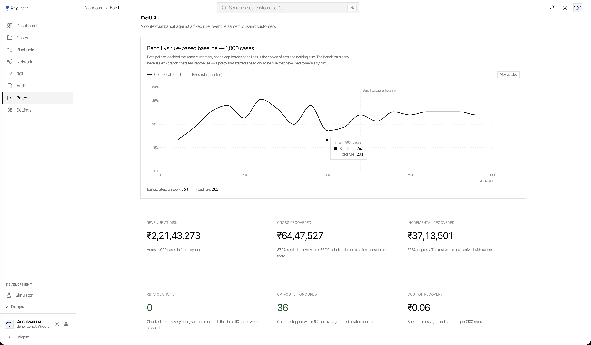
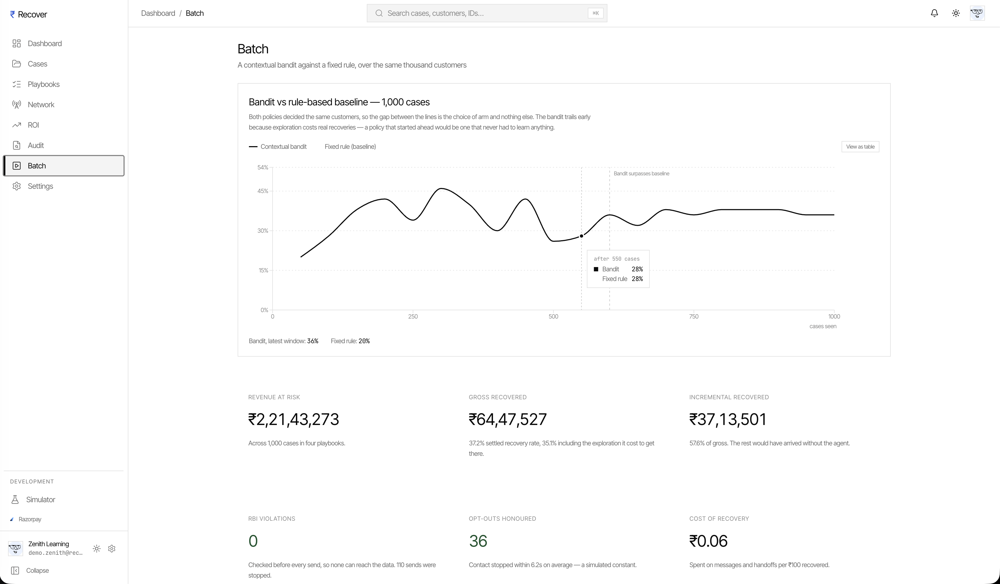
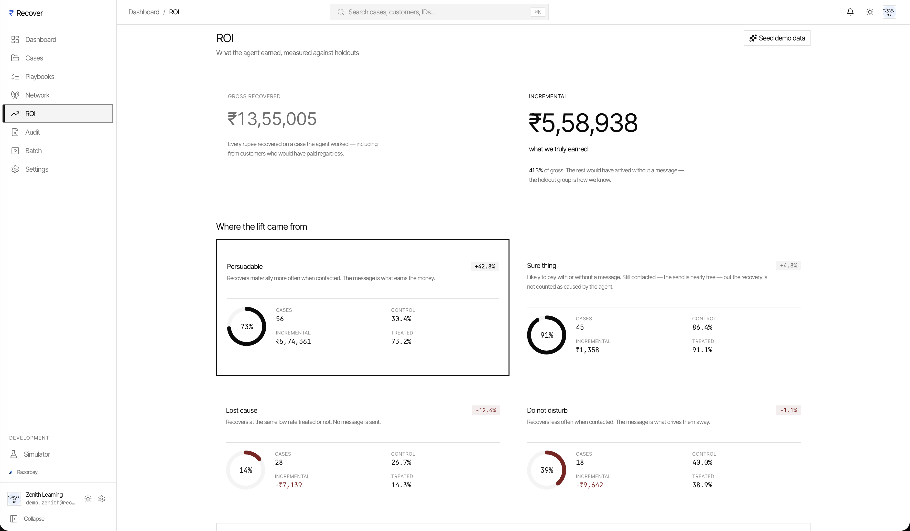
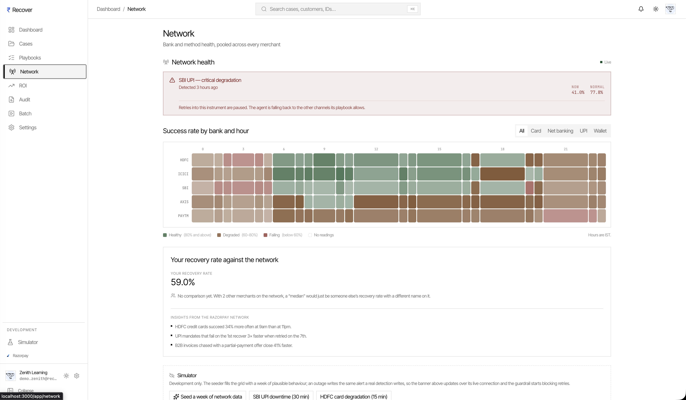
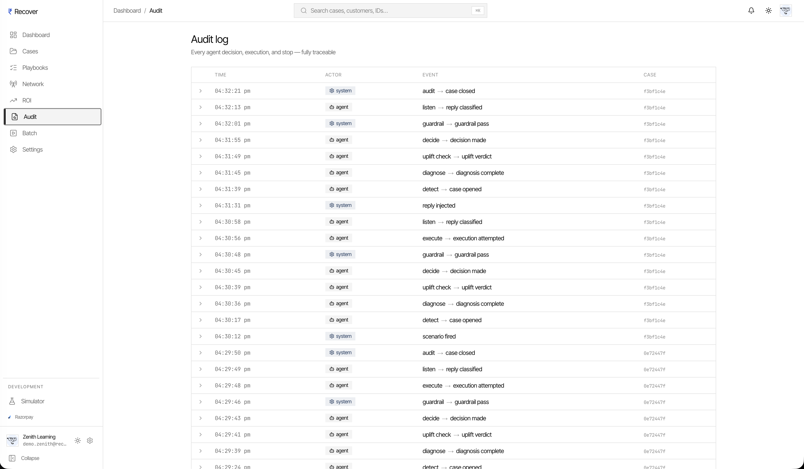
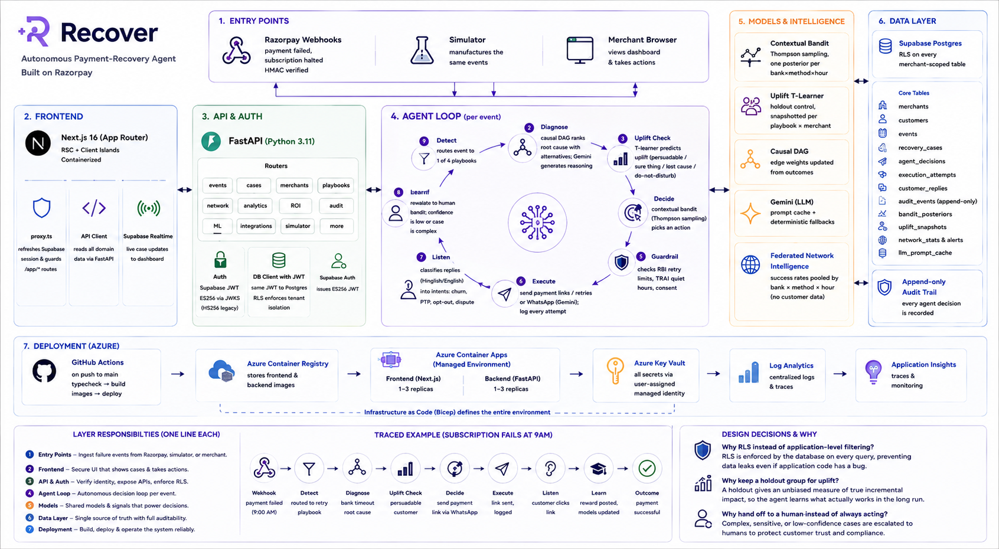

# Recover — an AI revenue recovery agent for Razorpay

Every Razorpay merchant loses revenue that was already won. A card declines at the
bank. A cart dies at the OTP screen. An autopay mandate fails on the 1st because the
customer's salary lands on the 7th. The standard answer is a dunning cron: retry three
times, send everyone the same reminders, and count whatever arrives afterwards as
recovered.

**Recover treats each failure as a case to diagnose, not a row to retry.** It works out
*why* the payment failed, decides whether contacting that customer helps at all, acts
only if compliance allows it, and then proves what it actually caused — as opposed to
what would have happened anyway.

| | |
| --- | --- |
| **Live app** | https://recover-aa-prod-frontend.ashybay-6728b979.eastasia.azurecontainerapps.io |
| **Demo video** | **▶ [Watch the 7-minute walkthrough](ADD_YOUR_VIDEO_LINK_HERE)** · narrated |
| **Sign in** | `demo.kajal@recoverapp.dev` · `demo.zenith@recoverapp.dev` · `demo.sharma@recoverapp.dev` — password `DemoRecover2026!` |

---

## Contents

| Section | For the reviewer who wants… |
| --- | --- |
| [1. The demo](#1-the-demo) | to watch it work, or drive it yourself |
| [2. What it does](#2-what-it-does) | the feature list, in one table |
| [3. How it works](#3-how-it-works) | the agent loop, step by step |
| [4. The four hard parts](#4-the-four-hard-parts) | the technique, and why each choice pays |
| [5. Results](#5-results) | the numbers, and how they were measured |
| [6. Screenshots](#6-screenshots) | the product, without installing anything |
| [7. System architecture](#7-system-architecture) | how the pieces fit |
| [8. Database](#8-database) | the schema, RLS, and live rows |
| [9. Deployment](#9-deployment) | that it really runs on Azure |
| [10. Tech stack](#10-tech-stack) | what it is built with |
| [11. Run it locally](#11-run-it-locally) | to run it themselves |
| [12. What is real, what is simulated](#12-what-is-real-what-is-simulated) | to know exactly what is being claimed |

---

## 1. The demo

**Watch:** [the 7-minute walkthrough](ADD_YOUR_VIDEO_LINK_HERE) — narrated, covering all
three merchants and every feature below.

**Or drive it yourself** at the live URL with any of the three logins above. Each is a
separate tenant with its own customers, its own playbook configuration, and its own
learned policy:

| Merchant | Vertical | What to look at |
| --- | --- | --- |
| Zenith Learning | Edtech subscriptions | Suresh — causal diagnosis · Vikram — churn detected, handed to a human |
| Kajal & Co. | D2C beauty | Priya — a generated Hinglish message · Aditya — recovered with no message at all · Sana — opted out, nothing sent |
| Sharma Distributors | B2B distribution | Meera — a promise-to-pay, tracked instead of chased |

The video is generated by a Playwright script, not screen-captured by hand —
[`frontend/tests/e2e/demo-recording.spec.ts`](frontend/tests/e2e/demo-recording.spec.ts).

---

## 2. What it does

| Feature | How it works | Why it matters |
| --- | --- | --- |
| **Causal diagnosis** | A per-playbook causal DAG runs Bayesian inference over bank, hour, instrument, customer history and live network health | `salary cycle mismatch · 0.82` is a posterior over a named hypothesis — not prose a model wrote |
| **Action selection** | Contextual bandit, Thompson sampling, one posterior per bank × method × hour × value bucket | Exploration scales with uncertainty. No epsilon to tune, no schedule to decay |
| **Uplift targeting** | A T-learner trained against a held-out control group sorts customers into persuadable / sure thing / lost cause / do-not-disturb | The agent can decline to spend a message on someone who would have paid anyway |
| **Compliance guardrail** | RBI retry limits, TRAI quiet hours and per-customer consent, checked *before* an action is chosen | Blocks are counted and reported, so "zero violations" has a denominator |
| **Message generation** | Gemini drafts in the customer's language and the brand's voice, with a database-backed prompt cache and deterministic fallbacks | A model outage degrades the copy instead of breaking the loop |
| **Reply understanding** | Classifies Hinglish and English replies into churn, promise-to-pay, opt-out, dispute | *"baaki 25 tak"* becomes a tracked promise, not another reminder |
| **Human handoff** | Churn and dispute intents stop the agent and escalate with full context | Retention is not a retry |
| **Network intelligence** | Success rates pooled across merchants by bank × method × hour; only rates are shared, never customer data | One merchant cannot tell a bank outage from bad luck. The network can |
| **Incremental ROI** | One case in twenty is held out untouched | Makes the headline figure incremental rather than gross |
| **Audit trail** | Every step, actor, and case written append-only | *"The model decided"* is not an answer you can give a regulator |
| **Batch simulator** | Replays hundreds of cases through both the bandit and a fixed rule over the same customers | Proves the learning is worth its cost, on camera |

---

## 3. How it works

One failed payment, start to finish. Every step writes its reasoning to the database,
and the case page shows all of it.

```
webhook ──► detect ──► diagnose ──► uplift check ──► decide ──► guardrail ──► execute ──► listen ──► learn
```

| Step | What happens |
| --- | --- |
| **detect** | Routes the event to one of four playbooks: failed payment, abandoned checkout, subscription failure, overdue invoice |
| **diagnose** | Causal DAG returns a ranked root cause with its alternatives and their posteriors |
| **uplift check** | Predicts whether contact changes the outcome. If not, the loop stops here — and that is a success, not a failure |
| **decide** | The bandit picks an action and records every arm it passed over, with confidence |
| **guardrail** | RBI retry caps, TRAI quiet hours, consent. A block is recorded with its reason |
| **execute** | A Razorpay retry or payment link, or a generated WhatsApp message. Every attempt is logged |
| **listen** | Classifies any reply and applies it — pause and track a promise, stop and hand off on churn, honour an opt-out |
| **learn** | Posts the reward to the bandit posterior and updates the causal edge weights |

---

## 4. The four hard parts

Four claims a reviewer should push on, and what backs each one.

**The diagnosis is a traversal, not a sentence.** Anyone can ask an LLM why a payment
failed. The DAG produces a posterior over named hypotheses, so the answer is inspectable
and the alternatives are visible. Gemini writes the explanation *of* the inference; it
does not perform it.

**The decision names what it rejected.** The case page shows every arm the bandit
considered with its posterior and its draw. A recommendation you cannot argue with is one
you cannot trust — and a bandit that only shows its winner is indistinguishable from a
hardcoded rule.

**The measurement is honest by construction.** Gross recovery is a vanity number: some of
those customers would have paid regardless. Holding one case in twenty untouched costs
real recoveries, and it is the only thing that turns a number into a claim.

**The intelligence compounds.** A merchant's first case in a new context starts from what
the network learned about that bank an hour ago, not from a flat prior. This is the part a
standalone tool cannot build — it needs a party that sees every merchant's retries, which
is a position Razorpay holds.

---

## 5. Results

From the batch run visible at `/app/batch` in the live app — 200 cases, both policies
deciding the *same* customers:

| | |
| --- | --- |
| Settled recovery rate | **36.0%** bandit vs **26.0%** fixed rule |
| Bandit overtakes baseline | case **50** |
| Gross recovered | **₹12,40,320** |
| Incremental (vs holdout) | **₹8,85,477** — 71% of gross |
| Compliance violations | **0**, against 15 retries and 17 messages the guardrail blocked |
| Opt-outs honoured | 2 of 2 |
| Escalated to a human | 4 |

The bandit *loses* early in that curve, and the dip is the point: exploration costs real
recoveries, and a policy that started ahead would be one that never had to learn.

---

## 6. Screenshots

> Images live in [`docs/screenshots/`](docs/screenshots/) — see that folder's README for
> the full list.

| | |
| --- | --- |
|  |  |
| **Dashboard** — recovery funnel, not a message count | **Cases** — every case with its uplift bucket |
|  |  |
| **Diagnosis** — root cause with its alternatives | **Decision** — the arms it passed over |
|  |  |
| **Batch** — bandit against a fixed rule | **ROI** — gross against incremental |
|  |  |
| **Network** — pooled bank health, live outage | **Audit** — every decision, append-only |

---

## 7. System architecture



> Source in [`docs/architecture/`](docs/architecture/).

Six layers, top to bottom:

1. **Entry** — Razorpay webhooks (HMAC-verified) and a built-in simulator that
   manufactures the same events. The simulator returns 404 outside development.
2. **Frontend** — Next.js 16 App Router. `proxy.ts` refreshes the Supabase session and
   guards `/app/*` before any page renders. All domain data comes through the API,
   never straight from the database.
3. **API and auth** — FastAPI. Supabase issues an ES256 JWT; the API verifies it against
   the project's JWKS, and the same token is attached to the database client so **Postgres
   RLS** enforces tenant isolation rather than application code remembering a `WHERE`.
4. **Agent loop** — the eight steps in [§3](#3-how-it-works), run as background tasks.
5. **Models** — bandit posteriors, uplift snapshots, causal DAG weights, the Gemini
   prompt cache, and the pooled network statistics.
6. **Data** — Supabase Postgres, RLS on every merchant-scoped table.

---

## 8. Database

Supabase Postgres. Schema in
[`supabase/migrations/`](supabase/migrations/); **snapshots of the live database in
[`docs/database/`](docs/database/)**.

| Group | Tables |
| --- | --- |
| Tenancy | `merchants`, `customers`, `payment_methods` |
| Recovery | `events`, `recovery_cases`, `agent_decisions`, `execution_attempts`, `customer_replies` |
| Learning | `bandit_arms`, `bandit_posteriors`, `bandit_rewards`, `uplift_model_snapshots`, `uplift_holdouts`, `causal_dag`, `causal_edge_updates` |
| Network | `network_stats`, `network_alerts` |
| Evidence | `audit_events`, `batch_runs`, `llm_cache` |

Two things worth checking in those snapshots:

- **RLS is on for every merchant-scoped table.** Tenant isolation is enforced by the
  database, so a missing filter in application code cannot leak another merchant's data.
- **`merchants.id` is `auth.users.id`.** A trigger creates the merchant row on signup, so
  a user and their tenant cannot drift apart.

---

## 9. Deployment

Live on Azure Container Apps. **Screenshots in [`docs/deployment/`](docs/deployment/).**

```
push to main ──► GitHub Actions ──► build images ──► Container Registry ──► Container Apps
                    (typecheck)                            │
                                                      Key Vault ──► managed identity
```

| Piece | What it does |
| --- | --- |
| Azure Container Apps | Frontend and backend, 1–3 replicas each |
| Container Registry | Holds both images |
| Key Vault | Every secret, read at runtime through a **user-assigned managed identity** — no credentials in the repo or the images |
| Log Analytics + App Insights | Logs and traces |
| Bicep | The whole environment as code — [`infra/main.bicep`](infra/main.bicep) |
| GitHub Actions | [`typecheck.yml`](.github/workflows/typecheck.yml) on every push, [`deploy.yml`](.github/workflows/deploy.yml) on `main` |

```bash
az deployment group create \
  --resource-group <rg> \
  --template-file infra/main.bicep \
  --parameters infra/main.parameters.json
```

---

## 10. Tech stack

| Layer | Choice |
| --- | --- |
| Frontend | Next.js 16 (App Router, RSC), React 19, TypeScript, Tailwind, Recharts, Framer Motion |
| Backend | FastAPI, Python 3.11, Pydantic, structlog |
| Database & auth | Supabase — Postgres, RLS, Auth (ES256 JWT), Realtime |
| AI | Google Gemini (`gemini-2.5-flash`) with a database prompt cache |
| ML | Thompson-sampling contextual bandit · T-learner uplift · Bayesian causal DAG |
| Payments | Razorpay — Payment Links, Subscriptions, Payment Gateway, webhooks |
| Infra | Azure Container Apps, Container Registry, Key Vault, App Insights, Bicep |
| Testing | 583 backend tests (pytest) · Playwright for the demo recording |

---

## 11. Run it locally

**Prerequisites:** Docker, Node 20, Python 3.11, Poetry, and a Supabase project.

```bash
# 1. Schema
supabase link --project-ref <your-project-ref> && supabase db push
#    or paste supabase/migrations/*.sql into the Supabase SQL editor

# 2. Environment — values from Supabase → Project Settings → API
cp .env.example .env
cp backend/.env.example backend/.env
cp frontend/.env.example frontend/.env.local

# 3. Run
docker compose up --build          # backend :8000, frontend :3000
cd frontend && npm run dev         # or the frontend on its own

# 4. Seed a full demo — three merchants, six personas, all scenarios
cd backend && .venv/bin/python scripts/prepare_demo.py
```

`prepare_demo.py` is what produced the data in the video: it creates the merchants,
loads fixtures, trains the uplift models, fires all six scenarios, runs a batch, and
writes `demo_state.json`.

---

## 12. What is real, what is simulated

Stated plainly, because a demo that blurs this is not worth trusting.

| | |
| --- | --- |
| **Real** | Razorpay integration in test mode — payment links are genuine `rzp.io` URLs, and paying one closes its case and moves the bandit posterior. Webhooks are HMAC-verified. Gemini calls are real. Supabase Auth, RLS, and Realtime are real. The Azure deployment is real. |
| **Simulated** | The customers and their payment failures — generated by the built-in simulator, because real ones do not fail on a schedule that suits a demo. WhatsApp sends go to a simulated adapter; the case detail shows `"simulated": true` beside every one. |

The agent cannot tell the difference between a simulated event and a real webhook — both
arrive through the same endpoint and run the same loop. That is the point of the
simulator, and it is why the behaviour you see is the behaviour you would get.

**The data is seeded deliberately, not faked:** three merchants across different
verticals, six customer personas, and hundreds of historical cases *with a real holdout
group*, so every feature is exercised against data that behaves like the real thing.
